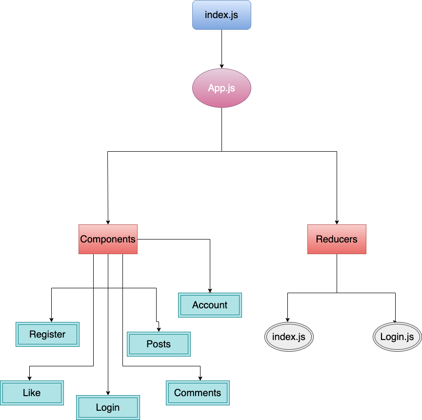

# Getting Started with Create React App

This project was bootstrapped with [Create React App](https://github.com/facebook/create-react-app).

## Available Scripts

In the project directory, you can run:

### `npm start`

Runs the app in the development mode.\
Open [http://localhost:3000](http://localhost:3000) to view it in the browser.

The page will reload if you make edits.\
You will also see any lint errors in the console.

### `npm test`

Launches the test runner in the interactive watch mode.\
See the section about [running tests](https://facebook.github.io/create-react-app/docs/running-tests) for more information.

### `npm run build`

Builds the app for production to the `build` folder.\
It correctly bundles React in production mode and optimizes the build for the best performance.

The build is minified and the filenames include the hashes.\
Your app is ready to be deployed!

See the section about [deployment](https://facebook.github.io/create-react-app/docs/deployment) for more information.

### `npm run eject`

**Note: this is a one-way operation. Once you `eject`, you can’t go back!**

If you aren’t satisfied with the build tool and configuration choices, you can `eject` at any time. This command will remove the single build dependency from your project.

Instead, it will copy all the configuration files and the transitive dependencies (webpack, Babel, ESLint, etc) right into your project so you have full control over them. All of the commands except `eject` will still work, but they will point to the copied scripts so you can tweak them. At this point you’re on your own.

You don’t have to ever use `eject`. The curated feature set is suitable for small and middle deployments, and you shouldn’t feel obligated to use this feature. However we understand that this tool wouldn’t be useful if you couldn’t customize it when you are ready for it.

## Learn More

You can learn more in the [Create React App documentation](https://facebook.github.io/create-react-app/docs/getting-started).

To learn React, check out the [React documentation](https://reactjs.org/).

### Code Splitting

This section has moved here: [https://facebook.github.io/create-react-app/docs/code-splitting](https://facebook.github.io/create-react-app/docs/code-splitting)

### Analyzing the Bundle Size

This section has moved here: [https://facebook.github.io/create-react-app/docs/analyzing-the-bundle-size](https://facebook.github.io/create-react-app/docs/analyzing-the-bundle-size)

### Making a Progressive Web App

This section has moved here: [https://facebook.github.io/create-react-app/docs/making-a-progressive-web-app](https://facebook.github.io/create-react-app/docs/making-a-progressive-web-app)

### Advanced Configuration

This section has moved here: [https://facebook.github.io/create-react-app/docs/advanced-configuration](https://facebook.github.io/create-react-app/docs/advanced-configuration)

### Deployment

This section has moved here: [https://facebook.github.io/create-react-app/docs/deployment](https://facebook.github.io/create-react-app/docs/deployment)

### `npm run build` fails to minify

This section has moved here: [https://facebook.github.io/create-react-app/docs/troubleshooting#npm-run-build-fails-to-minify](https://facebook.github.io/create-react-app/docs/troubleshooting#npm-run-build-fails-to-minify)


# About The Project:

 We taking everything we have learned into one web application, setting up the front end and back end with mongo db 

 **Here are the requirements:**
1. **Backend**
 - Bild our server
 - Connect our server with DataBase (mongo)
 - Start make our Schemas
 - Create our Controllers
 - Test All your Routs
 2. **Frontend**
 - Create React App
 - Create our Components
 - Create our Reducers
 - Test The web app
 


# Functionalities in the website:

1. Register 
2. LogIn
3. **SM:**
- Add new Post
- Read  Posts
- Edit Posts
- Delete Posts (Soft Delete)


# Tools used:
**Frontend**
1. **React**: To add Functionalities to my project.
2. **Trello**: Project management tool to orgnize the time 
and work.

**Backend**
1. Postman: To test our Routers


# Library That I Use:

```js
    axios: "^0.24.0",
    react: "^17.0.2",
    react-dom: "^17.0.2",
    react-router-dom: "^6.0.2",
    
    react-redux: "^7.2.6",
    redux: "^4.1.2",
    redux-devtools-extension: "^2.13.9",

```


# Components in the website:

1. Register 
```js
const signUp = async () => {
    const result = await axios.post(`${BASE_URL}/signUp`, {
      email,
      password,
      role,
    });
    console.log(result.data);
    navigate("/login")
  };
```
2. LogIn
```js
const logIn = async()=>{
    const result = await axios.post(`${BASE_URL}/login`,{
       email,
       password,
    
    });
    const data = {
      user: result.data.result,
      token: result.data.token,
    };
    dispatch(login(data));
    
    localStorage.setItem("token", result.data.token);

     navigate('/tasks')
}
```
3. Posts:

- Get Posts
```js
const getAllItems = async () => {
    try {
      const id = localStorage.getItem(state);
      const result = await axios.get(
        `http://localhost:5000/post`
      );

      setPosts(result.data);     
       console.log(result.data);
    } catch (err) {
      console.log(err);
    }
  };
```
- Add Post
```js
const addPost = async () => {
    try {
      const userId = localStorage.getItem("ID");
      const id = localStorage.getItem("ID");
      //console.log("the s  " + state.tasks.taskAdd);
      const result = await axios.post(
        `http://localhost:5000/newPost`,
        {
          img,
          desc,
          
        },
        {
          headers: { authorization: `Bearer ${localStorage.getItem("token")}` },
        }
      );

      console.log(result.data);

      getAllItems();
    } catch (err) {
      console.log(err);
    }
  };
  };
```
- Edit Post Img
```js
const updatePostImg = async (postId) => {
    try {
      const id = localStorage.getItem("token");
      const userId = localStorage.getItem("ID");
      const result = await axios.put(
        `http://localhost:5000/updateimg/${id}`,
        {
          
          img: postUpdated,
          
        },
        {
          headers: { authorization: `Bearer ${localStorage.getItem("token")}` },
        }
      );
      console.log(result.data);
      getAllItems();
    } catch (err) {
      console.log(err);
    }
  };
```

- Edit Post Desc
```js
const updatePostDesc = async (postId) => {
    try {
      const id = localStorage.getItem("token");
      const userId = localStorage.getItem("ID");
      const result = await axios.put(
        `http://localhost:5000/updatedesc/${id}`,
        {
          
          img: postUpdated,
          
        },
        {
          headers: { authorization: `Bearer ${localStorage.getItem("token")}` },
        }
      );
      console.log(result.data);
      getAllItems();
    } catch (err) {
      console.log(err);
    }
  };
```
- Delete Post
```js
const deletePost = async (postId) => {
    try {
      const userId = localStorage.getItem("ID");
      const result = await axios.delete(
        `${process.env.REACT_APP_BASE_URL}/post/delPost`,
        {
          data: { userId, postId },
          headers: { authorization: `Bearer ${localStorage.getItem("token")}` },
        }
      );
      getAllItems();
    } catch (err) {
      console.log(err);
    }
  };
```

4. Comments:

- Get Comments
```js
const getAllComment = async () => {
    try {
      const id = localStorage.getItem(state);
      const result = await axios.get(
        `http://localhost:5000/comments`
      );

      setComment(result.data);     
       console.log(result.data);
    } catch (err) {
      console.log(err);
    }
  };
```
- Add comment
```js
const addComment = async () => {
    try {
      const userId = localStorage.getItem("ID");
      const id = localStorage.getItem("ID");
      //console.log("the s  " + state.tasks.taskAdd);
      const result = await axios.post(
        `http://localhost:5000/newComment`,
        {
          img,
          desc,
          
        },
        {
          headers: { authorization: `Bearer ${localStorage.getItem("token")}` },
        }
      );

      console.log(result.data);

      getAllComments();
    } catch (err) {
      console.log(err);
    }
  };
  };
```
- Edit Comments
```js
const updateComment = async (postId) => {
    try {
      const id = localStorage.getItem("token");
      const userId = localStorage.getItem("ID");
      const result = await axios.put(
        `http://localhost:5000/updateComment/${id}`,
        {
          
          desc: commrntUpdated,
          
        },
        {
          headers: { authorization: `Bearer ${localStorage.getItem("token")}` },
        }
      );
      console.log(result.data);
      getAllComment();
    } catch (err) {
      console.log(err);
    }
  };
```


- Delete Comment
```js
const deletePost = async (commentId) => {
    try {
      const userId = localStorage.getItem("ID");
      const result = await axios.delete(
        `${process.env.REACT_APP_BASE_URL}/comment/delComment`,
        {
          data: { userId, postId },
          headers: { authorization: `Bearer ${localStorage.getItem("token")}` },
        }
      );
      getAllComments();
    } catch (err) {
      console.log(err);
    }
  };
```

4. Like

 
# Upload our Work on github:

| Command | Description |
| --- | --- |
| git add . | add our work  |
| git commit | add comment before upload it staged 
| git push | Upload it to your github Repo  |


# UML Diagram:




# Links:

1. Link of Trello board => https://trello.com/b/tKZzEVbO/project-2

2. My github Page => https://github.com/Eyad911


